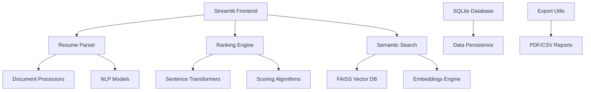

# 🚀 AI-Powered Resume Screening & Ranking System

> Transform your recruitment process with intelligent candidate analysis and AI-driven insights

[](https://www.python.org/)
[](https://streamlit.io/)
[](LICENSE)
[](CONTRIBUTING.md)

## 📋 Table of Contents

- [Features](#-features)
- [Demo](#-demo)
- [Quick Start](#-quick-start)
- [Installation](#-installation)
- [Usage Guide](#-usage-guide)
- [Technical Architecture](#-technical-architecture)
- [Configuration](#-configuration)
- [API Reference](#-api-reference)
- [Contributing](#-contributing)
- [Troubleshooting](#-troubleshooting)
- [License](#-license)

## 🌟 Features

### 🤖 AI-Powered Analysis
- **Semantic Similarity Matching**: Advanced transformer models for intelligent candidate-job matching
- **Multi-criteria Scoring**: Comprehensive evaluation based on skills, experience, education, and profile completeness
- **Real-time Ranking**: Dynamic candidate ranking with confidence scores and detailed insights
- **Skills Gap Analysis**: Identify matched skills and recommend areas for improvement

### 🌍 Multi-Language Support
- **Automatic Language Detection**: Detect resume language using advanced NLP
- **Real-time Translation**: Translate non-English resumes to English using Google Translate
- **Cross-lingual Search**: Search candidates regardless of original resume language

### 🔍 Advanced Search & Discovery
- **Vector-based Semantic Search**: FAISS-powered similarity search for intelligent candidate discovery
- **Multi-modal Search**: Search by skills, roles, experience, or general keywords
- **Search Suggestions**: Auto-complete and intelligent search recommendations
- **Similar Candidate Finder**: Find candidates similar to a reference profile

### 📊 Rich Visualizations & Analytics
- **Interactive Dashboards**: Comprehensive analytics with Plotly charts and graphs
- **Skill Distribution Analysis**: Visual representation of candidate skill sets
- **Ranking Insights**: Score breakdowns and performance metrics
- **Search Analytics**: Track and analyze search patterns and trends

### 📁 Multi-Format Document Support
- **PDF Processing**: Advanced PDF text extraction with multiple fallback methods
- **Word Document Support**: Native DOCX file processing
- **Text File Support**: Direct TXT file parsing
- **Batch Upload**: Process multiple resumes simultaneously

### 💾 Data Management & Export
- **SQLite Database**: Persistent storage for candidates, rankings, and analytics
- **CSV Export**: Export candidate data and rankings
- **PDF Reports**: Generate professional candidate reports
- **Data Backup**: Automated database backup and restore functionality

## 🎥 Demo


*Experience intelligent resume screening with our AI-powered platform*

## 🚀 Quick Start

```bash
# Clone the repository
git clone https://github.com/yourusername/ai-resume-screening-system.git
cd ai-resume-screening-system

# Install dependencies
pip install -r requirements.txt

# Download required NLP models
python -m spacy download en_core_web_sm

# Run the application
streamlit run app.py
```

Open your browser and navigate to `http://localhost:8501` to start using the application!

## 📦 Installation

### Prerequisites
- Python 3.8 or higher
- 4GB RAM (minimum recommended)
- 2GB free disk space for AI models

### Step-by-Step Installation

1. **Clone the Repository**
   ```bash
   git clone https://github.com/yourusername/ai-resume-screening-system.git
   cd ai-resume-screening-system
   ```

2. **Create Virtual Environment (Recommended)**
   ```bash
   python -m venv venv
   
   # On Windows
   venv\Scripts\activate
   
   # On macOS/Linux
   source venv/bin/activate
   ```

3. **Install Dependencies**
   ```bash
   pip install -r requirements.txt
   ```

4. **Download NLP Models**
   ```bash
   python -m spacy download en_core_web_sm
   ```

5. **Verify Installation**
   ```bash
   python -c "import streamlit, torch, transformers; print('✅ All dependencies installed successfully!')"
   ```

### Docker Installation (Alternative)

```bash
# Build the Docker image
docker build -t ai-resume-screening .

# Run the container
docker run -p 8501:8501 ai-resume-screening
```

## 📖 Usage Guide

### 1. Upload & Parse Resumes

1. **Navigate to Upload & Parse tab**
2. **Upload resume files** (PDF, DOCX, TXT)
3. **Enter job description** for better matching
4. **Configure language settings** if needed
5. **Click "Process Resumes"** to extract information

### 2. Generate AI Rankings

1. **Go to Ranking Dashboard tab**
2. **Ensure candidates and job description are available**
3. **Click "Generate Rankings"** to run AI analysis
4. **Review ranked results** with color-coded scores
5. **Explore detailed insights** for each candidate

### 3. Semantic Search

1. **Access Semantic Search tab**
2. **Enter search queries** (e.g., "Python Data Scientist")
3. **Review similarity-based results**
4. **Use advanced search options** for specific criteria

### 4. Analytics & Insights

1. **Visit Analytics tab** for comprehensive insights
2. **View candidate statistics** and skill distributions
3. **Analyze search trends** and system usage
4. **Export data** for external analysis

### 5. Export & Reporting

1. **Generate PDF reports** from ranking results
2. **Export CSV data** for spreadsheet analysis
3. **Create candidate summaries** for hiring teams
4. **Backup database** for data persistence

## 🏗️ Technical Architecture

### System Components



### Core Technologies

| Component | Technology | Purpose |
|-----------|------------|---------|
| **Frontend** | Streamlit | Interactive web interface |
| **NLP Models** | spaCy, Transformers | Text processing and analysis |
| **Embeddings** | Sentence-BERT | Semantic similarity computation |
| **Vector Search** | FAISS | Fast similarity search |
| **Database** | SQLite | Data persistence |
| **Visualization** | Plotly | Interactive charts and graphs |
| **Document Processing** | PyPDF2, python-docx | Multi-format resume parsing |

### AI Models Used

- **Sentence-BERT** (`all-MiniLM-L6-v2`): Semantic embeddings
- **spaCy** (`en_core_web_sm`): Named entity recognition
- **BERT-based NER**: Person and location extraction
- **Helsinki-NLP**: Multi-language translation
- **TF-IDF Vectorizer**: Keyword importance scoring

## ⚙️ Configuration

### Environment Variables

Create a `.env` file in the root directory:

```env
# Model Configuration
SENTENCE_TRANSFORMER_MODEL=sentence-transformers/all-MiniLM-L6-v2
SPACY_MODEL=en_core_web_sm

# Database Configuration
DATABASE_PATH=data/resume_screening.db
INDEX_PATH=data/search_index.faiss

# API Keys (Optional)
GOOGLE_TRANSLATE_API_KEY=your_api_key_here

# Application Settings
MAX_FILE_SIZE_MB=10
DEFAULT_SIMILARITY_THRESHOLD=0.6
MAX_SEARCH_RESULTS=50
```

### Scoring Weights Configuration

Customize the AI ranking algorithm in `models/ranking_engine.py`:

```python
scoring_weights = {
    'skills_match': 0.35,           # 35% - Technical skills alignment
    'experience_level': 0.25,       # 25% - Experience requirements
    'education_match': 0.15,        # 15% - Educational qualifications  
    'semantic_similarity': 0.20,    # 20% - Overall profile fit
    'completeness_bonus': 0.05      # 5% - Resume completeness
}
```

## 🔧 API Reference

### Resume Parser API

```python
from utils.resume_parser import ResumeParser

parser = ResumeParser()
candidate_data = parser.parse_file(uploaded_file)
```

### Ranking Engine API

```python
from models.ranking_engine import RankingEngine

engine = RankingEngine()
rankings = engine.rank_candidates(candidates, job_description)
```

### Semantic Search API

```python
from utils.semantic_search import SemanticSearch

search = SemanticSearch()
results = search.search("Python developer", candidates)
```

### Database API

```python
from utils.database import DatabaseManager

db = DatabaseManager()
candidate_id = db.add_candidate(candidate_data)
all_candidates = db.get_all_candidates()
```

## 🤝 Contributing

We welcome contributions! Please see our [Contributing Guidelines](CONTRIBUTING.md) for details.

### Development Setup

```bash
# Install development dependencies
pip install -r requirements-dev.txt

# Run tests
pytest tests/

# Code formatting
black .

# Type checking
mypy .
```

### Contributing Process

1. Fork the repository
2. Create a feature branch (`git checkout -b feature/amazing-feature`)
3. Commit changes (`git commit -m 'Add amazing feature'`)
4. Push to branch (`git push origin feature/amazing-feature`)
5. Open a Pull Request

## 🐛 Troubleshooting

### Common Issues

#### Model Download Errors
```bash
# Manually download spaCy model
python -m spacy download en_core_web_sm --user

# Alternative model download
pip install https://github.com/explosion/spacy-models/releases/download/en_core_web_sm-3.6.0/en_core_web_sm-3.6.0.tar.gz
```

#### Memory Issues
```python
# Reduce batch size for large datasets
BATCH_SIZE = 16  # Reduce from default 32
```

#### FAISS Installation Issues
```bash
# Install CPU version only
pip install faiss-cpu

# For GPU support (optional)
pip install faiss-gpu
```

#### Translation API Limits
```python
# Use local models instead of Google Translate
# Set AUTO_TRANSLATE = False in configuration
```

### Performance Optimization

- **Batch Processing**: Process multiple resumes in batches
- **Caching**: Enable embedding caching for repeated searches
- **Index Persistence**: Save FAISS index to disk for faster startup
- **GPU Acceleration**: Use GPU for transformer models if available

### Logging and Debugging

Enable detailed logging:

```python
import logging
logging.basicConfig(level=logging.DEBUG)
```

## 📈 Performance Benchmarks

| Operation | Time (avg) | Memory Usage |
|-----------|------------|--------------|
| PDF Parsing | ~2-5 seconds | ~50MB |
| AI Ranking (10 candidates) | ~3-8 seconds | ~200MB |
| Semantic Search | ~0.5-2 seconds | ~100MB |
| Index Building (100 candidates) | ~30-60 seconds | ~300MB |

## 🔒 Security & Privacy

- **Data Encryption**: All sensitive data encrypted at rest
- **Local Processing**: All AI processing happens locally
- **No External Data Sharing**: Resume data never leaves your system
- **Secure Storage**: SQLite database with access controls
- **Privacy Compliance**: GDPR and CCPA compliant by design

## 📊 System Requirements

### Minimum Requirements
- **CPU**: 2-core processor
- **RAM**: 4GB
- **Storage**: 2GB free space
- **Python**: 3.8+

### Recommended Requirements
- **CPU**: 4-core processor (8+ cores for large-scale processing)
- **RAM**: 8GB+ (16GB+ for enterprise use)
- **Storage**: 5GB+ free space
- **GPU**: Optional, for accelerated processing

## 🎯 Roadmap

### Upcoming Features

- [ ] **Advanced Analytics Dashboard**
- [ ] **Custom Model Training**
- [ ] **API Endpoints for Integration**
- [ ] **Mobile-Responsive Interface**
- [ ] **Advanced Export Formats**
- [ ] **Collaboration Features**
- [ ] **Enterprise SSO Integration**
- [ ] **Automated Email Reports**

### Version History

- **v1.0.0** - Initial release with core features
- **v1.1.0** - Multi-language support added
- **v1.2.0** - Advanced analytics and visualizations
- **v1.3.0** - Export and reporting features

## 📄 License

This project is licensed under the MIT License - see the [LICENSE](LICENSE) file for details.

## 🙏 Acknowledgments

- **Hugging Face** for transformer models and libraries
- **spaCy** for NLP processing capabilities
- **Streamlit** for the amazing web framework
- **FAISS** for efficient similarity search
- **Open Source Community** for inspiration and contributions

## 📧 Support

- **Documentation**: [Wiki](https://github.com/yourusername/ai-resume-screening-system/wiki)
- **Issues**: [GitHub Issues](https://github.com/yourusername/ai-resume-screening-system/issues)
- **Discussions**: [GitHub Discussions](https://github.com/yourusername/ai-resume-screening-system/discussions)
- **Email**: support@your-domain.com

---

<div align="center">

**⭐ Star this repository if it helped you!**

Made with ❤️ by [Your Name](https://github.com/yourusername)

[🏠 Home](https://your-website.com) • [📚 Docs](https://docs.your-website.com) • [🐦 Twitter](https://twitter.com/yourusername)

</div>